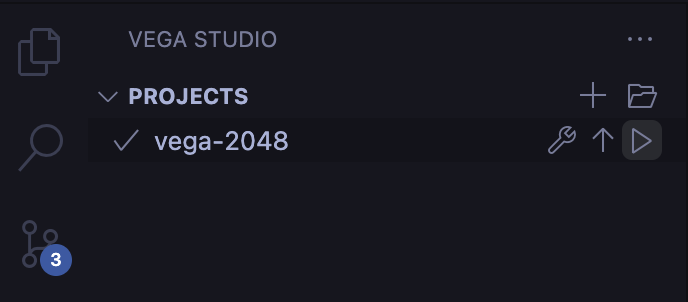

# Vega 2048


### This repository contains the 2048 example from Reanimated reference app modified to work as a standalone game for Vega OS.

### The full documentation and more examples of using Reanimated can be found in the official documentation at: https://docs.swmansion.com/react-native-reanimated.

## 🔨 Building the project

### ⚙️ Preqrequisites

#### Vega SDK

Make sure that you have Vega SDK installed on your machine. This step requires an Amazon Developer account which can be created at: https://developer.amazon.com. Installation guide for Vega SDK is available at: https://developer.amazon.com/docs/vega/0.21/install-vega-sdk.html.

#### Device

Make sure that the physical device you want to use is connected to your machine or that the simulator (Vega Virtual Device) has been started using the following command:

```bash
kepler virtual-device start
```

In either case the device of your choice should be visible when executing:

```
✗ vda devices
List of devices attached
emulator-5554	device
```

Or, if you haven't set up direct access for Vega SDK tools:

```
✗ kepler exec vda devices
List of devices attached
emulator-5554	device
```

**Note:** You can also verify that the device is connected using the [Vega Studio](https://marketplace.visualstudio.com/items?itemName=amazon-devices.kepler-studio) extension for Visual Studio Code. The device of your choice should be visible in the list in the `DEVICES` section in the extension view.

#### Dependencies

Make sure that all required dependencies are installed by running the following command at the root directory of the project:

```bash
npm install
```

### 🏗️ Building and installing the app

The application can be built, installed, and launched on the device either using the CLI commands provided by Vega SDK or from your IDE by using the [Vega Studio](https://marketplace.visualstudio.com/items?itemName=amazon-devices.kepler-studio) extension. The sections below cover both workflows.

#### Using the CLI

To build the application run the following command:

```bash
npm run build:app
```

It will build both Debug and Release profiles of the app. If you want to build only one of the profiles you can use the following commands:

```bash
npm run build:debug

npm run build:release
```

Make sure to select the built virtual package (vpkg) with a right architecture:

- `armv7` for physical devices
- `aarch64` for Vega Virtual Device on Mac M-series machines
- `x86_64` for Vega Virtual Device on x86_64 devices

The package can be installed on the device using the following command:

```
kepler run-kepler <path-to-vpkg> com.swmansion.vega2048.main -d VirtualDevice
```

Besides the path to the vpkg we also specify the main component id, which can be found in the `manifest.toml` file:

```toml
[components]
[[components.interactive]]
id = "com.swmansion.vega2048.main"
```

And the target device on which we want to install and launch the application. Full reference on running apps on devices can be found at: https://developer.amazon.com/docs/vega/0.21/run-apps.html.

If you want to set up **Fast Refresh** and **React Native Packager**, please follow the steps at: https://developer.amazon.com/docs/vega/0.21/fast-refresh.html.

#### Using Vega Studio

Navigate to the **Vega Studio** extension view and click the **▶** button on the project item in the `PROJECTS` section to automatically build, install, and launch the application on the device.



It will also automatically start the **React Native Packager** so that the application is reloaded whenever you make changes to its code.

## [Community Discord](https://discord.swmansion.com)

[Join the Software Mansion Community Discord](https://discord.swmansion.com) to chat about **Vega 2048** and other Software Mansion solutions.

## This project is created by [Software Mansion](https://swmansion.com)

[](https://swmansion.com)

Since 2012 [Software Mansion](https://swmansion.com) is a software agency with
experience in building web and mobile apps. We are Core React Native
Contributors and experts in dealing with all kinds of React Native issues. We
can help you build your next dream product –
[Hire us](https://swmansion.com/contact/projects).

Made by [@software-mansion](https://github.com/software-mansion) 💙
